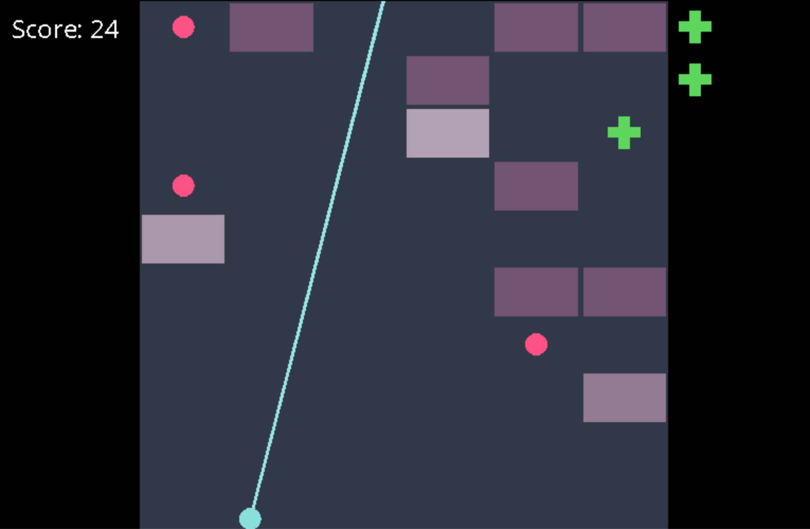

# Swipe Brick Breaker
Recreation of mobile game Swipe Brick Breaker with additional features in C

## Dependencies


## Installation

### Dependencies
- llvm
- sdl2
- sdl2_gfx
- sdl2_ttf

You can use ```brew install``` to install those packages easily.

## Usage
To run the game, go to the main directory of the repository, and run the following commands.

```shell
$ make
$ ./bin/game
```

You might get a build failure due to error in finding the font directory. In that case, change FONT_DIR to the full file path in library/sdl_wrapper.c.

## How to Play
The game is very simple to play. Use the left / right arrow keys to control the trajectory and the space bar to shoot. If the bricks reach the bottom, the game will end and display your score.

### Collectibles
This game has extra collectibles as additional features to the original game.
- Bomb (Red Star) - Destroys all bricks in the screen
- Life (Green Cross) - Gives an extra life that saves you from losing once (collected on the right side)

## Gameplay Screenshot

